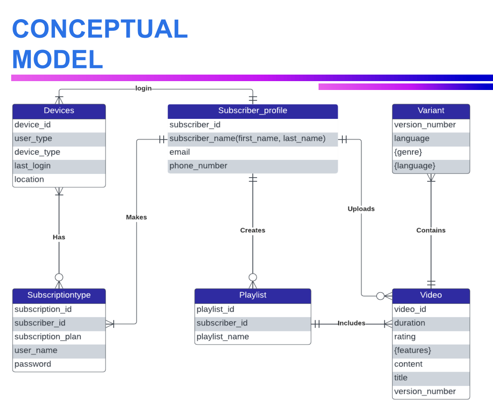
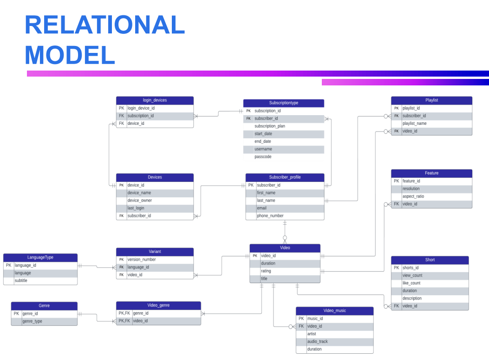
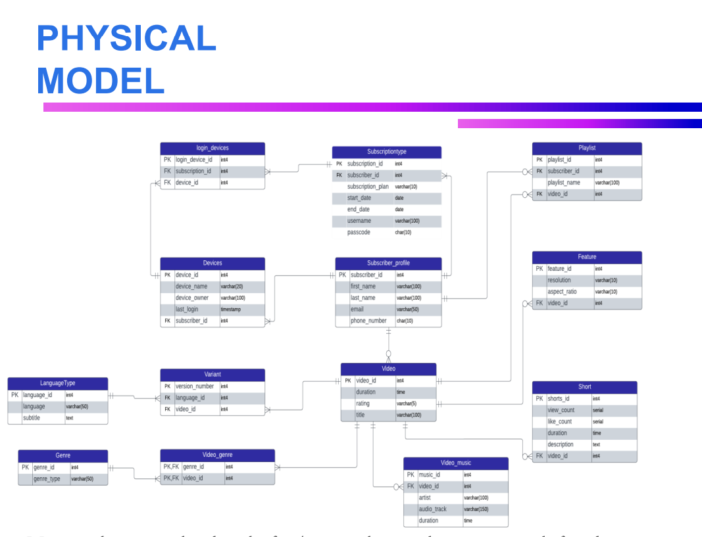

# 📘 Disney+ Hotstar Database Enhancement Project  
### *IS 6420 — Fall 2023*  
**Team Members:**  
- **Munjuluri Omkar Sai**  
- **Uchechi Unamma**

---

## ⭐ Executive Summary  
This project proposes several enhancements to the Disney+ Hotstar streaming platform through the development of a database system that supports:  
- **Hotstar Music Videos**  
- **Hotstar Shorts**  
- **Performance Optimization Features**  

These enhancements aim to boost user engagement, reduce churn, and position Disney+ Hotstar as a competitive leader in the streaming industry.

---

## 📌 Project Objectives  

### 🎯 1. Enhanced User Engagement  
Introducing music videos and short-form video content to increase user activity and broaden entertainment options.

### 🎯 2. Improved Retention  
Providing an optimized viewing experience to reduce buffering issues and enhance user satisfaction.

### 🎯 3. Market Leadership  
Offering unique content features that distinguish Disney+ Hotstar from competitors.

---

## 🧠 General Background  

### Background & Launch  
- Hotstar launched in **2015** as a streaming service under Novi Digital Entertainment.  
- Rapid growth followed due to live sports, TV shows, and regional content.  

### Rebranding  
- In **2020**, Hotstar became **Disney+ Hotstar**, integrating Disney, Pixar, Marvel, Star Wars, and National Geographic content.

### Global Expansion  
- Disney+ Hotstar expanded beyond India, becoming an integral part of Disney’s global streaming strategy.

---

## 🚀 New Venture — Business Need  

Disney+ Hotstar lost **34% of its subscriber base** due to:  
- Loss of IPL streaming rights  
- Removal of HBO content  
- Increased competition  

This project proposes adding music videos and shorts to re-engage users and reduce churn by offering diverse, high-impact features.

---

## 🏗️ Database Design

### 1️⃣ **Conceptual Model**  
Includes key entities such as:  
- Subscriber  
- Subscription Type  
- Devices  
- Video  
- Music Video  
- Shorts  
- Playlist  
- Genre  
- Language  
- Variant  

---

### 2️⃣ **Relational (Logical) Model**  
Designed in **3rd Normal Form**.  
Includes bridge tables for many-to-many relationships:  
- `video_genre`  
- `login_devices`

---

### 3️⃣ **Physical Model (SQL Implementation)**  
The SQL schema includes complete table creation scripts such as:

```sql
CREATE TABLE Video (
  video_id INT PRIMARY KEY,
  duration TIME,
  rating VARCHAR(5),
  title VARCHAR(100)
);

CREATE TABLE Feature (
  feature_id INT PRIMARY KEY,
  resolution VARCHAR(10),
  aspect_ratio VARCHAR(10),
  video_id INT REFERENCES Video(video_id)
);

CREATE TABLE Subscriber_profile (
  subscriber_id INT PRIMARY KEY,
  first_name VARCHAR(100),
  last_name VARCHAR(100),
  email VARCHAR(50),
  phone_number CHAR(10)
);
```
## 🧩 Data Models

### 1. Conceptual Model
This diagram represents the high-level view of the Disney+ Hotstar system, including core entities like **Subscriber Profile**, **Devices**, **Subscription Type**, **Playlist**, **Variant**, and **Video**, along with their main relationships.



---

### 2. Relational Model
The relational model shows how the conceptual entities are converted into relational tables with **primary keys**, **foreign keys**, and **bridge tables** such as `login_devices` and `video_genre`.



---

### 3. Physical Model
The physical model includes actual data types for each column (e.g., `int4`, `varchar(50)`, `timestamp`, `time`) and represents how the schema is implemented in the database.



## 📊 Sample Data Used  

The sample data used in this project was categorized into the following lists:

- **30 Subscribers**  
- **30 Subscription Types**  
- **30 Devices**  
- **30 Videos**  
- **30 Playlists**  
- **30 Video Music files**  
- **30 Shorts**  
- **30 Languages**  

These datasets were generated to simulate realistic platform usage and were inserted into the database using SQL scripts. Each subscriber was assigned structured subscription details, device activity, playlists, and media interactions to support testing and validation of the database design.
## 🧪 Requirement Summary  

### ✅ High Priority  
- **Video Quality:** Support high-resolution streaming and optimized delivery.  
- **User Profiles:** Allow multiple user profiles under one account.  
- **Offline Downloads:** Enable users to download and watch content offline.  
- **User Data Security:** Ensure strong security processes to protect personal data.  
- **User Reviews & Ratings:** Allow users to rate and review content.

### 🟡 Medium Priority  
- **UI Enhancements:** Improve navigation and overall interface usability.  
- **Content Curation:** Provide curated lists such as “Top Picks” or trending shows.  
- **Multilingual Support:** Offer content and subtitles in multiple languages.

### 🔵 Low Priority  
- **In-App Purchases:** Allow upgrades or add-on purchases within the application.  
- **Personalized Playlists:** Allow users to create customized playlists.  
- **Parental Controls:** Provide controls to restrict age-sensitive content.

### 🔧 Non-Functional Requirements  
- **Accessibility:** Ensure inclusive design for all user groups.  
- **Scalability:** System must support future growth in users and content.  
- **Cost-Effectiveness:** Optimize running costs while maintaining quality.  
- **Content Licensing Compliance:** Ensure all content follows legal distribution rules.
## 🏁 Conclusion  

The Disney+ Hotstar database enhancement project introduces new capabilities such as music videos, short-form content, and performance-optimized streaming features. These additions aim to strengthen user engagement, reduce churn, and elevate the platform’s competitive positioning.

The database design supports structured storage for videos, music, genres, variants, subscribers, devices, playlists, and login activities. The proposed solution integrates strategic, ethical, and technical considerations, including user data protection, licensing compliance, and scalable architecture.

With improved content offerings, enhanced data structure, and well-defined requirements, this project provides a strong foundation for delivering an engaging and reliable user experience across the Disney+ Hotstar platform.
